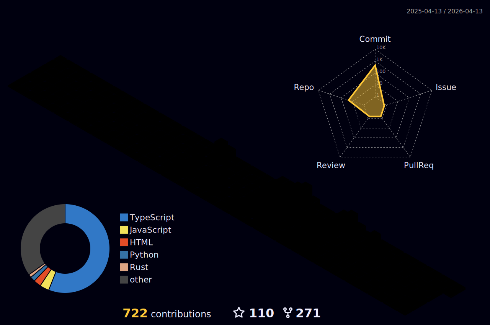

  

  <h1 align="center">👋 Hi there, I'm Chinmay Patil</h1>
  
  

  

    
    
    
    
    
  

---

### 👨‍💻 About Me

I am a **Computer Science Engineer** and **Tech Entrepreneur** based in **Bengaluru**. My passion lies at the intersection of **Artificial Intelligence**, **Cybersecurity**, and **Web3**.

- 🚀 **Currently:** Building **Anthé Labs**, focusing on next-gen blockchain solutions.
- 🔭 **Project:** Developing a **Copy Trading Bot** on Kana Labs (Ctrl+Move Hackathon).
- ⚡ **Tech:** Focused on **NestJS**, **Next.js**, and **Solidity**.

---

### 🛠️ Tech Stack

| **Frontend** | **Backend & AI** | **Web3 & Blockchain** | **Tools** |
| :---: | :---: | :---: | :---: |
|  |  |  |  |

---

### 📊 GitHub Stats & Contributions

  <table>
    <tr>
      <td>
        
      </td>
      <td>
        
      </td>
    </tr>
  </table>

  

   
  

### 🏆 Achievements

  

---
### 🧱 My 3D Contributions

  

  <i>"The best way to predict the future is to invent it."</i>

  
